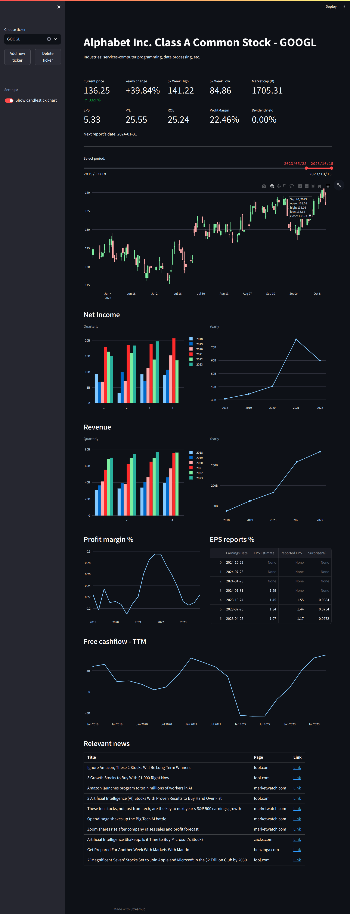
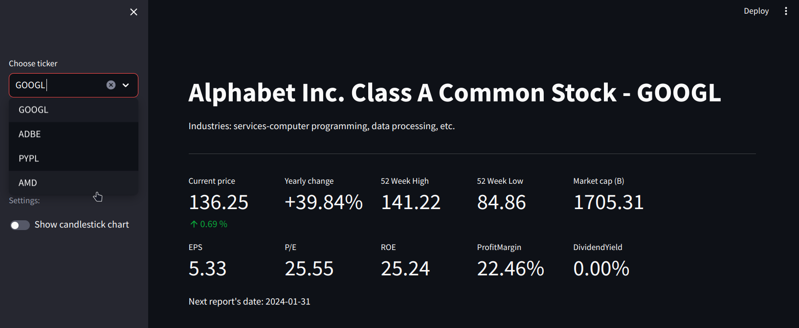
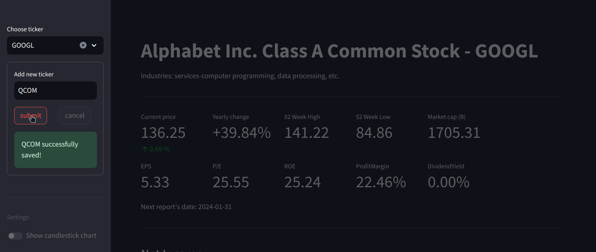
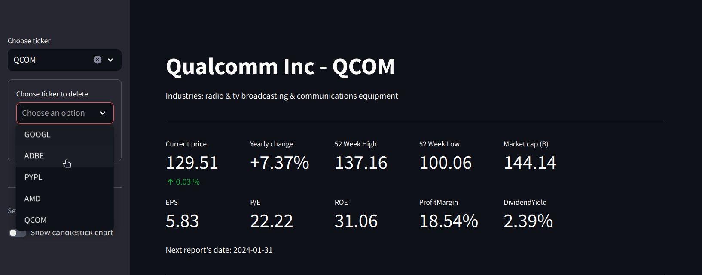

# Stock Dashboard
## Overview

This project is a personalized dashboard built using the Streamlit Python library, designed to display key financial metrics and stock information for selected companies. The dashboard provides a concise summary of a company's fundamentals.

To fetch the data it use 2 API:
- [**Polygon.io**](https://polygon.io/): Its used to obtain  financials, key details, and the relevant news of the given company. Currently (2023.11.21) it only has a freqency limit of 5 request per minute with the free subscription, Which is really generous compared the other data providers. The downside of this API is that it returns data in really raw format from the SEC fillings, that requires significant transformation before it can be used effectively.

- [**Yfinance**](https://pypi.org/project/yfinance/):  Its a python library using the Yahoo Finance API. I use it to retrieve price and dividend history and to get the next report date.

## Project Structure

- **src/polygon_api.py:** Manages API requests to Polygon.io, fetching fundamental data, ticker details, and relevant news.
- **src/json_io.py:** Handles JSON input/output operations, streamlining the storage of user data.
- **src/data_processor.py:** Include transformation steps, processing raw data from both Polygon.io and Yahoo Finance APIs.
- **src/daily_price_api.py:** Custom wrapper module for the yfinance Python library, retrieving price and dividend data, along with upcoming report dates.
- **src/component.py:** Contains front-end components, including plots, configuration methods, and Streamlit-related functionalities.
- **src/tickers.json:** The user's saved tickers are stored in this file.
- **src/tests:** Contains Pytest test files for executing unit tests.

## Screenshots of the application

 The whole page:

Selecting ticker:

Adding new ticker:

Deleting existing ticker:

